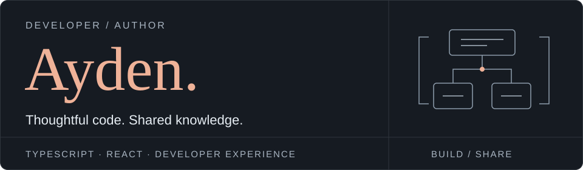

<strong>English</strong> &nbsp; / &nbsp; <a href="./README.ko.md">한국어</a>

<picture>
  <source media="(max-width: 600px)" srcset="./assets/header-mobile.svg">
  
</picture>

# Hi, I'm Ayden.

**정진호 · TypeScript developer** 
Author of 『모던 리액트 디자인 패턴』

I turn complex development problems into small, predictable interfaces. My work spans React applications, state and form libraries, and standard-first backend architecture.

I care about the decisions behind the code: where state belongs, how responsibilities are divided, and what makes an API easy to understand. I build tools to explore those questions, then share what I learn through open source and writing.

  <a href="https://ayden94.com/"><strong>Read my journal</strong></a>
  &nbsp; · &nbsp;
  <a href="https://www.linkedin.com/in/jinho-jeong-8ab999345/">LinkedIn</a>
  &nbsp; · &nbsp;
  <a href="https://wikibook.co.kr/react-design-patterns/">My book</a>

 

## The book

  

### 모던 리액트 디자인 패턴

**Modern React Design Patterns** 
Wikibooks · July 2026 · Written in Korean

React is easy to start with; designing an application that remains easy to change takes more thought.

In this book, I explore component structure, state management, reusable logic, asynchronous UI, and TypeScript patterns through practical code. The focus is not on memorizing patterns, but on understanding the problems they solve and choosing the right approach for your application.

**[About the book](https://wikibook.co.kr/react-design-patterns/)** &nbsp; / &nbsp; [Example code](https://github.com/wikibook/react-design-patterns)

 

## What I'm building

### [ilokesto](https://github.com/ilokesto)

**Small packages. Clear responsibilities.**

A TypeScript ecosystem for recurring UI, state, form, and networking problems. I keep the core logic independent of frameworks and the adapters thin, so the same ideas can work across different environments.

- **State & forms** — predictable stores, state transitions, and form behavior.
- **UI primitives** — composable overlays, modals, and toasts.
- **Networking** — focused fetch utilities and supporting packages.

[`store`](https://github.com/ilokesto/store) · [`state`](https://github.com/ilokesto/state) · [`form`](https://github.com/ilokesto/form) · [`overlay`](https://github.com/ilokesto/overlay) · [`fetcher`](https://github.com/ilokesto/fetcher)

### [fluo](https://github.com/fluojs/fluo)

**A standard-first TypeScript backend framework.**

An exploration of the whole backend application surface, not just routing. I use standard decorators and modular boundaries to bring dependency injection, configuration, validation, serialization, and API documentation together.

- **Application foundations** — DI, configuration, and reusable modules.
- **HTTP & APIs** — routing, validation, serialization, and OpenAPI.
- **Runtime boundaries** — a framework core separated from platform adapters, with Node.js, Bun, Deno, and Cloudflare Workers in mind.

 

## Open source

Projects I've contributed to through code, documentation, and proposed fixes.

**[stableref](https://github.com/JoviDeCroock/stableref)** &nbsp; / &nbsp;
**[zustand-middleware-pipe](https://github.com/zustandjs/zustand-middleware-pipe)** &nbsp; / &nbsp;
**[senpi](https://github.com/code-yeongyu/senpi)** &nbsp; / &nbsp;
**[oh-my-openagent](https://github.com/code-yeongyu/oh-my-openagent)** &nbsp; / &nbsp;
**[open-code-review](https://github.com/alibaba/open-code-review)**

## Ideas I keep coming back to

| Focus | What interests me |
| :--- | :--- |
| **Frontend architecture** | Component boundaries, state ownership, and structures that stay understandable as applications grow. |
| **Library design** | Small APIs, useful type inference, and cores that are not tied to a single framework. |
| **Developer experience** | Tools, documentation, examples, and naming that make the next person's work easier. |
| **AI-assisted development** | Coding agents and review tools that fit into real development workflows. |

## Writing

I write to make the reasoning behind software easier to follow — not just how to use a tool, but why it was designed that way.

My journal covers frontend architecture, state management, dependency injection, TypeScript library design, and the trade-offs behind technical decisions.

**[Visit ayden94.com](https://ayden94.com/)**

## Toolbox & credentials

| Area | Technologies |
| :--- | :--- |
| Languages | TypeScript · JavaScript |
| Frontend | React · Next.js |
| Backend | Node.js · Express · NestJS |
| Testing | Jest · Vitest |
| Infrastructure | AWS · Vercel · Netlify |
| Development | Git · GitHub · pnpm |

**AWS Certified Solutions Architect**

---

  <a href="https://ayden94.com/">Journal</a> &nbsp; · &nbsp;
  <a href="https://www.linkedin.com/in/jinho-jeong-8ab999345/">LinkedIn</a> &nbsp; · &nbsp;
  <a href="./README.ko.md">한국어로 읽기</a>

