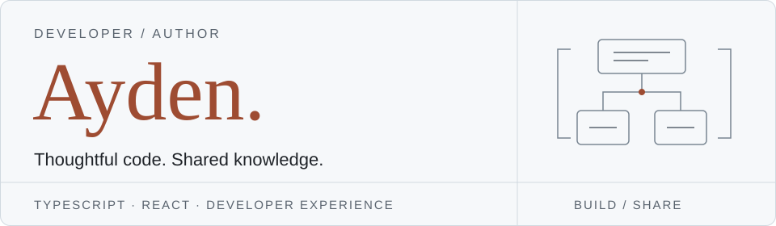

<strong>English</strong> &nbsp; / &nbsp; <a href="./README.ko.md">한국어</a>

<picture>
  <source media="(prefers-color-scheme: dark) and (max-width: 900px)" srcset="./assets/header/mobile-dark.svg">
  <source media="(max-width: 900px)" srcset="./assets/header/mobile-light.svg">
  <source media="(prefers-color-scheme: dark)" srcset="./assets/header/desktop-dark.svg">
  
</picture>

# Hi, I'm Ayden.

**정진호 · TypeScript developer** 
Author of 『모던 리액트 디자인 패턴』

I turn complex development problems into small, predictable interfaces. My work spans React applications, state and form libraries, and standard-first backend architecture.

I care about the decisions behind the code: where state belongs, how responsibilities are divided, and what makes an API easy to understand. I build tools to explore those questions, then share what I learn through open source and writing.

  <a href="https://ayden94.com/"><strong>Read my journal</strong></a>
  &nbsp; · &nbsp;
  <a href="https://www.linkedin.com/in/jinho-jeong-8ab999345/">LinkedIn</a>
  &nbsp; · &nbsp;
  <a href="https://wikibook.co.kr/react-design-patterns/">My book</a>

 

## The book

  

### 모던 리액트 디자인 패턴

**Modern React Design Patterns** 
Wikibooks · July 2026 · Written in Korean

React is easy to start with; designing an application that remains easy to change takes more thought.

In this book, I explore component structure, state management, reusable logic, asynchronous UI, and TypeScript patterns through practical code. The focus is not on memorizing patterns, but on understanding the problems they solve and choosing the right approach for your application.

**[About the book](https://wikibook.co.kr/react-design-patterns/)** &nbsp; / &nbsp; [Example code](https://github.com/wikibook/react-design-patterns)

 

## What I'm building

### [ilokesto](https://github.com/ilokesto/ilokesto)

**Small tools that compose, with a core that stays independent.**

ilokesto means “toolbox” in Esperanto. I build it as a collection of focused TypeScript libraries for recurring frontend problems, rather than one library that owns the whole application.

The design starts with plain TypeScript cores and thin framework bindings where they are needed. Packages keep their own responsibilities and versions; shared conventions come before shared abstractions. The goal is to make state, forms, and UI behavior understandable on their own and reusable across projects.

Packages are published under `@ilokesto/`.

| Package | Responsibility |
| :--- | :--- |
| [store](https://github.com/ilokesto/ilokesto/tree/main/packages/store) | Framework-independent state storage, updates, and subscriptions. |
| [state](https://github.com/ilokesto/ilokesto/tree/main/packages/state) | State composition and thin bindings for multiple frameworks. |
| [form](https://github.com/ilokesto/ilokesto/tree/main/packages/form) | Form state, field metadata, and Standard Schema validation. |
| [utilinent](https://github.com/ilokesto/ilokesto/tree/main/packages/utilinent) | Small declarative React components for recurring rendering patterns. |
| [overlay](https://github.com/ilokesto/ilokesto/tree/main/packages/overlay) | Overlay state and lifecycle management. |
| [modal](https://github.com/ilokesto/ilokesto/tree/main/packages/modal) | Modal interactions. |
| [toast](https://github.com/ilokesto/ilokesto/tree/main/packages/toast) | Toast notifications. |
| [fetcher](https://github.com/ilokesto/ilokesto/tree/main/packages/fetcher) | Fetch-based networking utilities. |

### [fluo](https://github.com/fluojs/fluo)

**Standards first. Explicit composition. Clear boundaries.**

fluo is a TypeScript backend framework built on TC39 standard decorators and explicit dependency injection. I want application structure to be visible in the code: which modules own a feature, which dependencies they use, and where their responsibilities end.

Instead of relying on legacy decorator metadata, fluo declares dependencies explicitly and composes capabilities through packages. The framework core stays separate from host adapters, and runtime support is defined per package rather than assumed. Predictable contracts, testable behavior, and documented limits matter as much as a convenient API.

Package names use the `@fluojs/` scope.

| Area | Packages |
| :--- | :--- |
| Core | [core](https://github.com/fluojs/fluo/tree/main/packages/core), [di](https://github.com/fluojs/fluo/tree/main/packages/di), [runtime](https://github.com/fluojs/fluo/tree/main/packages/runtime), [config](https://github.com/fluojs/fluo/tree/main/packages/config), [i18n](https://github.com/fluojs/fluo/tree/main/packages/i18n) |
| HTTP & APIs | [http](https://github.com/fluojs/fluo/tree/main/packages/http), [validation](https://github.com/fluojs/fluo/tree/main/packages/validation), [serialization](https://github.com/fluojs/fluo/tree/main/packages/serialization), [openapi](https://github.com/fluojs/fluo/tree/main/packages/openapi), [graphql](https://github.com/fluojs/fluo/tree/main/packages/graphql) |
| Auth | [jwt](https://github.com/fluojs/fluo/tree/main/packages/jwt), [passport](https://github.com/fluojs/fluo/tree/main/packages/passport) |
| Data | [prisma](https://github.com/fluojs/fluo/tree/main/packages/prisma), [drizzle](https://github.com/fluojs/fluo/tree/main/packages/drizzle), [mongoose](https://github.com/fluojs/fluo/tree/main/packages/mongoose), [redis](https://github.com/fluojs/fluo/tree/main/packages/redis), [cache-manager](https://github.com/fluojs/fluo/tree/main/packages/cache-manager) |
| Messaging | [microservices](https://github.com/fluojs/fluo/tree/main/packages/microservices), [cqrs](https://github.com/fluojs/fluo/tree/main/packages/cqrs), [event-bus](https://github.com/fluojs/fluo/tree/main/packages/event-bus), [queue](https://github.com/fluojs/fluo/tree/main/packages/queue), [cron](https://github.com/fluojs/fluo/tree/main/packages/cron) |
| Realtime | [websockets](https://github.com/fluojs/fluo/tree/main/packages/websockets), [socket.io](https://github.com/fluojs/fluo/tree/main/packages/socket.io), [notifications](https://github.com/fluojs/fluo/tree/main/packages/notifications), [email](https://github.com/fluojs/fluo/tree/main/packages/email), [slack](https://github.com/fluojs/fluo/tree/main/packages/slack), [discord](https://github.com/fluojs/fluo/tree/main/packages/discord) |
| Operations | [terminus](https://github.com/fluojs/fluo/tree/main/packages/terminus), [metrics](https://github.com/fluojs/fluo/tree/main/packages/metrics), [throttler](https://github.com/fluojs/fluo/tree/main/packages/throttler) |
| Adapters | [Fastify](https://github.com/fluojs/fluo/tree/main/packages/platform-fastify), [Express](https://github.com/fluojs/fluo/tree/main/packages/platform-express), [Node.js](https://github.com/fluojs/fluo/tree/main/packages/platform-nodejs), [Next.js](https://github.com/fluojs/fluo/tree/main/packages/platform-nextjs), [Bun](https://github.com/fluojs/fluo/tree/main/packages/platform-bun), [Deno](https://github.com/fluojs/fluo/tree/main/packages/platform-deno), [Workers](https://github.com/fluojs/fluo/tree/main/packages/platform-cloudflare-workers) |
| Tooling | [react](https://github.com/fluojs/fluo/tree/main/packages/react), [cli](https://github.com/fluojs/fluo/tree/main/packages/cli), [testing](https://github.com/fluojs/fluo/tree/main/packages/testing), [vite](https://github.com/fluojs/fluo/tree/main/packages/vite), [studio](https://github.com/fluojs/fluo/tree/main/packages/studio) |

 

## Open source

Projects I've contributed to through code, documentation, and proposed fixes.

| Project | Focus |
| :--- | :--- |
| **[stableref](https://github.com/JoviDeCroock/stableref)** | React hooks |
| **[zustand-middleware-pipe](https://github.com/zustandjs/zustand-middleware-pipe)** | Zustand middleware |
| **[senpi](https://github.com/code-yeongyu/senpi)** | Coding agents |
| **[oh-my-openagent](https://github.com/code-yeongyu/oh-my-openagent)** | Agent orchestration |
| **[open-code-review](https://github.com/alibaba/open-code-review)** | AI code review |

## Ideas I keep coming back to

**Frontend architecture** 
Component boundaries, state ownership, and structures that stay understandable as applications grow.

**Library design** 
Small APIs, useful type inference, and cores that are not tied to a single framework.

**Developer experience** 
Tools, documentation, examples, and naming that make the next person's work easier.

**AI-assisted development** 
Coding agents and review tools that fit into real development workflows.

## Writing

I write to make the reasoning behind software easier to follow — not just how to use a tool, but why it was designed that way.

My journal covers frontend architecture, state management, dependency injection, TypeScript library design, and the trade-offs behind technical decisions.

**[Visit ayden94.com](https://ayden94.com/)**

## Toolbox & credentials

| Area | Technologies |
| :--- | :--- |
| Languages | TypeScript · JavaScript |
| Frontend | React · Next.js |
| Backend | Node.js · Express · NestJS |
| Testing | Jest · Vitest |
| Infrastructure | AWS · Vercel · Netlify |
| Development | Git · GitHub · pnpm |

**AWS Certified Solutions Architect**

---

  <a href="https://ayden94.com/">Journal</a> &nbsp; · &nbsp;
  <a href="https://www.linkedin.com/in/jinho-jeong-8ab999345/">LinkedIn</a> &nbsp; · &nbsp;
  <a href="./README.ko.md">한국어로 읽기</a>

